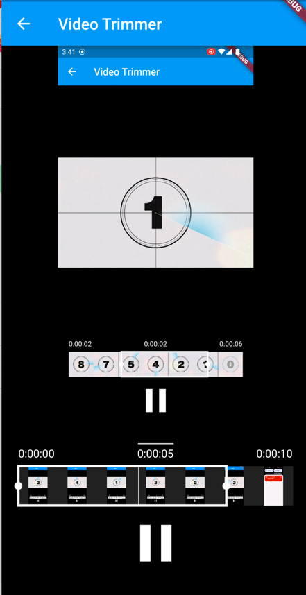

<a href="https://github.com/Solido/awesome-flutter">
   
</a>
<a href="https://pub.dev/packages/video_trimmer">
  
</a>
<a href="https://github.com/sbis04/video_trimmer/stargazers">
  
</a>
<a href="https://github.com/sbis04/video_trimmer/blob/master/LICENSE">
  
</a>

<p align="center">
  
</p>

<h4 align="center">A Flutter package for trimming videos</h4>

### Features

* Customizable video trimmer
* Loop video by trimmer.
* Very light trimmer ui(by deleting real trimming and support package).
* But no real trimming. You can get `startPos`, `endPos` by double.
* It doesn't even have a storage function. 


<h4 align="center">TRIM EDITOR</h4>

<p align="center">
  
</p>

<h4 align="center">EXAMPLE APP</h4>
이거랑 비슷하게 돌아감~ 무한 반복되고 save가 없다는것 빼면!!


<h4 align="center">CUSTOMIZABLE VIDEO EDITOR</h4>

<p align="center">
  
</p>

## Usage

Add the dependency `video_trimmer` to your **pubspec.yaml** file:

```yaml
dependencies:
  git:
    url: https://github.com/bluejoyq/video_trimmer.git
```

### Android configuration

No additional configuration is needed for using on Android platform. You are good to go!

### iOS configuration

* Add the following keys to your **Info.plist** file, located in `<project root>/ios/Runner/Info.plist`:
  ```
  <key>NSCameraUsageDescription</key>
  <string>Used to demonstrate image picker plugin</string>
  <key>NSMicrophoneUsageDescription</key>
  <string>Used to capture audio for image picker plugin</string>
  <key>NSPhotoLibraryUsageDescription</key>
  <string>Used to demonstrate image picker plugin</string>
  ```


## Functionalities

### Loading input video file

```dart
final Trimmer _trimmer = Trimmer();
await _trimmer.loadVideo(videoFile: file);
```


### Video playback state 

Returns the video playback state. If **true** then the video is playing, otherwise it is paused.

```dart
await _trimmer.videPlaybackControl(
  startValue: _startValue,
  endValue: _endValue,
);
```

### Advanced Command

You can use an advanced **FFmpeg** command if you require more customization. Just define your FFmpeg command using the `ffmpegCommand` property and set an output video format using `customVideoFormat`. 

Refer to the [Official FFmpeg Documentation](https://ffmpeg.org/documentation.html) for more information.

> **NOTE:** Passing a wrong video format to the `customVideoFormat` property may result in a crash.

```dart
// Example of defining a custom command

// This is already used for creating GIF by
// default, so you do not need to use this.

await _trimmer
    .saveTrimmedVideo(
        startValue: _startValue,
        endValue: _endValue,
        ffmpegCommand:
            '-vf "fps=10,scale=480:-1:flags=lanczos,split[s0][s1];[s0]palettegen[p];[s1][p]paletteuse" -loop 0',
        customVideoFormat: '.gif')
    .then((value) {
  setState(() {
    _value = value;
  });
});
```

## Widgets

### Display a video playback area

```dart
VideoViewer(trimmer: _trimmer)
```

### Display the video trimmer area

```dart
TrimEditor(
  trimmer: _trimmer,
  viewerHeight: 50.0,
  viewerWidth: MediaQuery.of(context).size.width,
  maxVideoLength: Duration(seconds: 10),
  onChangeStart: (value) {
    _startValue = value;
  },
  onChangeEnd: (value) {
    _endValue = value;
  },
  onChangePlaybackState: (value) {
    setState(() {
      _isPlaying = value;
    });
  },
)
```

## Example

See example directory.

## Troubleshooting

While running on the Android platform if it gives an error that the `minSdkVersion` needs to be `24`, or on iOS platform that the Podfile platform version should be `11`, first go to `pubspec.lock` file and see if the version of `ffmpeg_kit_flutter` has `-LTS` suffix. This should fix all issues for iOS platform.

On Android, if you still face the same issue, try adding the following to the `<project_directory>/android/app/src/main/AndroidManifest.xml`:

```
<manifest xmlns:tools="http://schemas.android.com/tools" ....... >
    <uses-sdk tools:overrideLibrary="com.arthenica.ffmpegkit.flutter, com.arthenica.ffmpegkit" />
</manifest>
```

## License
original version : https://github.com/sbis04/video_trimmer   
Copyright (c) 2022 Souvik Biswas

Permission is hereby granted, free of charge, to any person obtaining a copy
of this software and associated documentation files (the "Software"), to deal
in the Software without restriction, including without limitation the rights
to use, copy, modify, merge, publish, distribute, sublicense, and/or sell
copies of the Software, and to permit persons to whom the Software is
furnished to do so, subject to the following conditions:

The above copyright notice and this permission notice shall be included in all
copies or substantial portions of the Software.

THE SOFTWARE IS PROVIDED "AS IS", WITHOUT WARRANTY OF ANY KIND, EXPRESS OR
IMPLIED, INCLUDING BUT NOT LIMITED TO THE WARRANTIES OF MERCHANTABILITY,
FITNESS FOR A PARTICULAR PURPOSE AND NONINFRINGEMENT. IN NO EVENT SHALL THE
AUTHORS OR COPYRIGHT HOLDERS BE LIABLE FOR ANY CLAIM, DAMAGES OR OTHER
LIABILITY, WHETHER IN AN ACTION OF CONTRACT, TORT OR OTHERWISE, ARISING FROM,
OUT OF OR IN CONNECTION WITH THE SOFTWARE OR THE USE OR OTHER DEALINGS IN THE
SOFTWARE.
